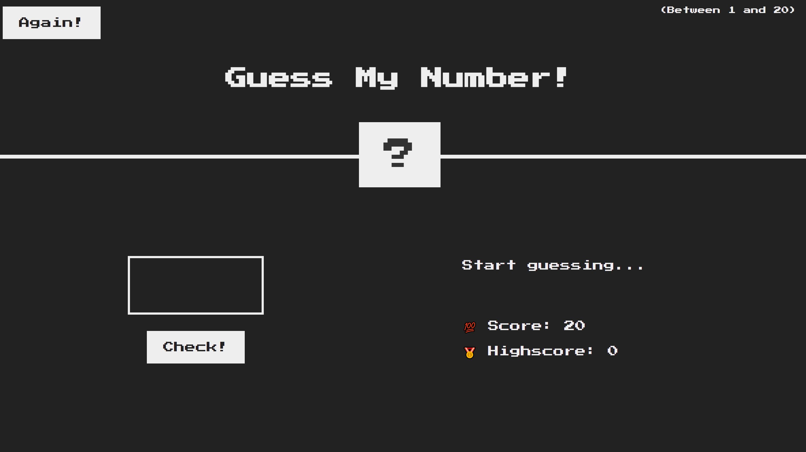

# Guess My Number

Practicing JavaScript while taking the course "The Complete JavaScript Course: From Zero to Expert" (https://www.udemy.com/share/101WeY3@k-6lu8fMGfb2XAyn-DbsKXCKeaxDUUdXCv-VVfGaCSZYAVODIN2dvoXc4gYapbMA-Q==/).

## Overview

The game is about guessing a number between 0 and 20, with 20 attempts before the user looses the game, with an "Again!" button to reset the game.
The highscore is captured and displayed, and it is maintained as the highest score ever reached to guess the right number.

## Technologies Used

- DOM manipulation
- random number generation
- Functions
- if else statements

## Links

    - **Solution URL:** https://j-b-r-93.github.io/JavaScript---Guess-My-Number/

    - **Live Site URL:** https://github.com/J-B-R-93/JavaScript---Guess-My-Number

## Screenshot

